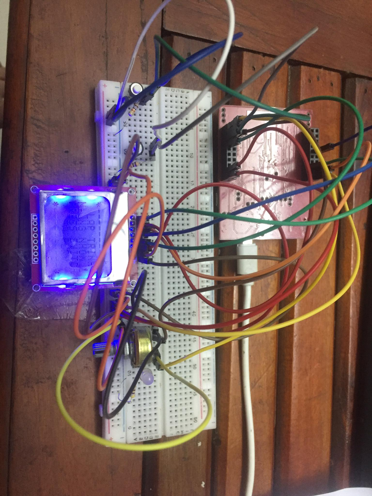
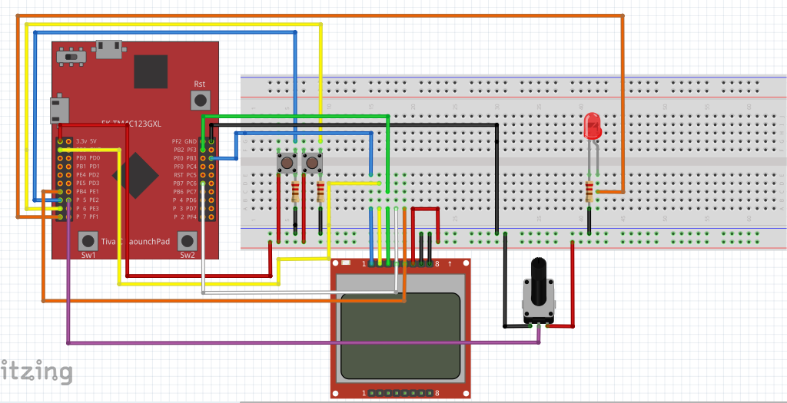

# SPACE-INVADERS-FREERTOS-TIVA-C
## Mục lục
[I.Description](#Description)

[II.Game-Instructions](#Game)

[III.Putting It Together](#PuttingItTogether)
- [1.Bill of Materials](#BillofMaterials)
- [2.Wiring](#Wiring)
- [3.Display](#Display)
- [4.Potentiometer and buttons](#4)

[IV.Programming](#Programming)
- [1.IDE](#IDE)
- [2.Libraries](#Lib)

===========================

### I.Description
This is a my final project at course Embedded System Progamming at HCMUT. The project idea is to make Space Invaders game with my LaunchPad to apply all concepts that teached through this course like ADC,GPIO,Interrupts,SPI,Timer,FreeRTOS...etc. Only Demo, not Professional. 

### II.Game-Instructions
The game consists one level. You have to kill 15 enemies. Enemy will try to kill you by their laser shoots so you need to dodge it and kill enemies before you are be killed or enemies reaches bottom line. You have Fire button, POT(to change resistor value) to move, LCD to visualize the game and a special button to clear all laser on screen (but need time to charge). 

### III.Putting It Together

#### 1.Bill of Materials
- [TM4C123GXL - LAUNCHPAD Tiva C](https://www.ti.com/tool/EK-TM4C123GXL)
- 
- [Nokia 5110 LCD](https://www.sparkfun.com/products/10168)
- [Potentionmeter 10K Ohm](https://www.amazon.com/Best-Sellers-Potentiometers/zgbs/industrial/306810011)
- [Buttons](http://www.eu.diigiit.com/mini-pushbutton-switch)
- [Jumper wire male male](https://www.amazon.com/Solderless-Flexible-Breadboard-Jumper-Arduino/dp/B00ARTWJ44)

#### 2.Wiring

#### 3.Display
- 1 -> PB3
- 2 -> PB5
- 3 -> PB2
- 4 -> PB7
- 5 -> PB4
- 6 -> 3V3
- 7 -> GND
- 8 -> GND

#### 4.Potentiometer and buttons
- POT -> PE2
- BUTTONS -> PA5,PA6
- LED -> PA7
